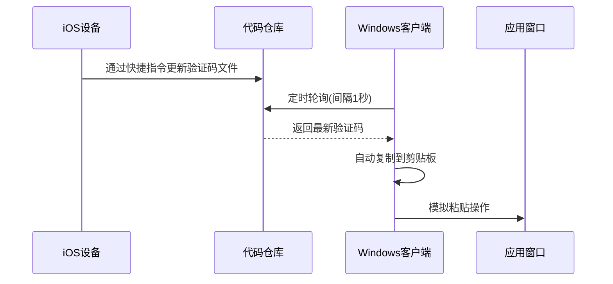

# 跨平台验证码同步助手


## 项目概述

本工具实现Windows系统与iOS设备间的验证码无缝同步，通过Git平台中转验证码信息，提供以下核心功能：

### Windows端功能
- 🔑 热键触发（默认 Alt+C）
- 📋 自动粘贴验证码
- ⚙️ 多平台支持（GitHub/Gitee）
- 🖥️ 系统托盘常驻

### iOS端功能
- 📱 快捷指令自动读取短信验证码
- ⏱️ 实时更新Git仓库验证码
- 🔒 基于个人访问令牌的安全同步

## 环境要求
- Go 1.22+ (仅编译需要)
- Windows 10/11
- GitHub/Gitee账号

## 安装使用

### 使用
直接下载[最新版本](https://example.com/download)的 `verifyCodeHelper.exe`

### 源码编译
```bash
go build -ldflags="-H windowsgui" -o verifyCodeHelper.exe
```

依赖管理：
```bash
go mod tidy
```

## 配置说明

复制 `config.example.yaml` 为 `config.yaml`，按需修改以下参数：

```yaml
# 基础配置
settings:
  interval: 2000       # 主循环间隔(ms)
  hotkey: "Alt C"      # 触发热键(空格分隔)
  max_date_diff_seconds: 120  # 验证码有效期
  polling_interval_milliseconds: 1000  # 轮询间隔
  max_polling_attempts: 10    # 最大重试次数

# GitHub配置
github:
  token: "your_token"  # 个人访问令牌(PAT)
  repository: "user/repo" # 代码仓库
  path: "code.json"    # 验证码文件路径
  interval: 3          # API检查间隔(秒)

# Gitee配置
gitee: 
  token: "your_token"  # Gitee私人令牌
  repository: "user/repo"
  path: "code.json"
  interval: 3
```

## 使用流程



## 注意事项

### 安全警告
⚠️ 配置文件包含敏感信息，请：
1. 不要将 `config.yaml` 提交到Git仓库
2. 使用最小权限的访问令牌
3. 定期轮换访问凭证

### 常见问题
- 🔄 **同步延迟**：确保仓库路径正确，检查网络连接
- ⌨️ **热键冲突**：修改 `hotkey` 配置使用组合键如 Ctrl+Shift+C
- ⚠️ **权限错误**：确认PAT具有 repo 读写权限
- 📁 **文件路径**：保持大小写一致，建议使用全小写路径

## 开发指南

### 项目结构
```
.
├── api.go            # Git平台接口实现
├── hotkey.go         # 热键管理模块
├── main.go           # 程序入口
├── config.example.yaml # 配置模板
└── verifyCodeHelper.exe # 编译输出
```

### 依赖说明
- 系统托盘: github.com/getlantern/systray
- 剪贴板操作: golang.design/x/clipboard
- 热键管理: golang.design/x/hotkey

## 授权协议
[MIT License](LICENSE)